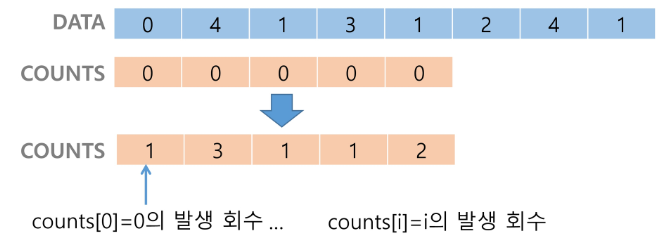

# 버블 정렬 (Bubble Sort)

## ▶ 정렬 과정

* 배열 내에서 **연속된 두 항목을 가리킨 후 첫 번째 항목과 두 번째 항목을 비교한다.**

* 첫 번째 값이 두 번째 값보다 크면 두 항목을 교환한다.
  
  * **순서가 올바르다면 아무것도 하지 않고 포인터만 이동**시킨다.

* 두 항목을 가리키던 포인터를 오른쪽으로 한 셀씩 옮긴다.

* 배열의 끝까지 or 이미 정렬된 값까지 위 3 단계를 반복 = 첫 번째 패스스루 종료

* 이제 두 포인터를 다시 배열의 처음 두 값으로 옮겨서 위 4단계를 재실행 = 새로운 패스스루 실행

```python
def bubble_sort(a, N):
    for i in range(N-1, 0, -1):
        for j in range(0, i):
            if a[j] > a[j+1]:
                a[j], a[j+1] = a[j+1], a[j]
```

## ▶ 효율성 = O(N**2)

* **비교 - 어느 쪽이 더 큰지 두 수를 비교**
  
  * 첫 번째 패스스루를 거치면 마지막 숫자가 올바른 위치로 가기 때문에 마지막 두 수를 비교할 필요가 없다. (비교횟수는 점점 줄어듬)
  
  * **(N-1) + (N-2) + ... + 1번의 비교 수행**

* **교환 - 정렬하기 위해 두 수 를 교환**
  
  * **내림차순으로 정렬된 최악의 시나리오라면 비교할 때마다 교환을 진행!**

* **N이 증가할 때마다 단계 수가 대략 N\*\*2 만큼 늘어난다.**

```python
def greatestProduct(array):    # 모든 숫자쌍의 최대곱을 찾는 함수
    greatestProductSoFar = array[0] * array[1]

    for i, iVal in enumerate(array):
        for j, jVal in enumerate(array):
            if i != j and iVal * jVal > greatestProductSoFar:
                greatestProductSoFar = iVal * jVal
```

```python
def greatestNumber(array):    # 배열에서 가장 큰 하나를 찾는 함수
    
    maxV = array[0]
    for i in array:
        # i가 가장 크다고 가정
        isIValTheGreatest = True

        for j in array:
        # i 보다 큰 값을 찾으면, i는 가장 큰 수가 아님
            if j > i:
                isIValTheGreatest = False
    # 나머지 수를 모두 확인한 후에도 i가 가장 크면, i가 가장 큰 수
    if isIValTheGreatest:
        return i
```


# 카운팅 정렬 (Counting Sort)

> **항목들의 순서를 결정하기 위해 집합에 각 항목이 몇 개씩 있는지 세는 작업을 진행**

## ▶ 제한 사항

* 정수나 정수로 표현할 수 있는 자료에 대해서만 사용 가능

* 개수를 세기 위해 충분한 공간을 할당하려면 집합 내의 가장 큰 정수를 알아야 함

## ▶ 효율성 = O(n + k)****

> **n 은 리스트의 길이, k 는 정수의 최대값**

* 비교환 방식이며, n이 비교적 작을 때만 사용 가능하다.

## ▶ 정렬 과정

* 배열에서 각 항목들의 발생 횟수를 세고, 정수 항목들로 직접 인덱스 되는 카운트 배열에 저장한다 - **`counts[i] = i의 발생 횟수`**
  
  

* **정렬된 집합에서 각 항목의 앞에 위치할 항목의 개수를 반영하기 위해 누적합을 진행**

* 새로운 배열에 i를 삽입하고 카운트 배열에 1을 감소 시킨다.

```python
def Counting_Sort(A, B, K)
# A 는 입력 배열(1~k), B 는 정렬된 배열, C 는 카운트 배열
    C = [0] * (k+1)

    for i in range(0, len(A)):
        C[A[i]] += 1

    for i in range(1, len(C)):    # 카운트 배열 업데이트
        C[i] += C[i-1]

    for i in range(len(B)-1, -1, -1):    # 정렬된 배열에 입력 배열 원소 삽입
        C[A[i]] -= 1
        B[C[A[i]]] = A[i]
```


# 선택 정렬 (Selection Sort)

> 주어진 값들 중 **가장 작은 값의 원소부터 차례대로 선택하여 위치를 교환하는 방식**

## ▶ 정렬 과정

* 배열의 각 셀을 확인하면서 주어진 값 중에서 최소값을 찾는다.

* **최소값의 인덱스와 패스스루를 처음 시작했을 때의 값을 교환**

* 맨 처음 위치를 제외한 나머지 리스트를 대상으로 위의 과정을 반복

## ▶ 효율성 = O(n**2)

* 비교와 교환, 두 종류의 단계를 포함

* **사실은 O(n\*\*2/2) 단계이므로 선택정렬이 버블정렬보다 두배나 빠르다고 볼 수 있다.**

```python
def selectionSort(a, N):
    for i in range(N-1):
        minIdx = i
        for j in range(i+1, N):
            if a[minIdx] > a[j]:
                minIdx = j
        a[i], a[minIdx] = a[minIdx], a[i]
```

```python
def print_numbers_version_one(upperLimit): # 제한 범위 내 모든 짝수를 출력 
    number = 2

    while number <= upperLimit:
        if number % 2 == 0:
            print(number)

        number += 1

def print_numbers_version_two(upperLimit):
    number = 2

    while number <= upperLimit:
        print(number)

        number += 2
```

```python
def double_then_sum(array): # 주어진 배열의 모든 수를 두 배로 만드는 함수 
    double_array = []

    array.each do |number|
        doubled_array << number *= 2
    end

    sum = 0
    doubled_array.each do |number|
        sum += number
    end
    
    return sum
end
```


