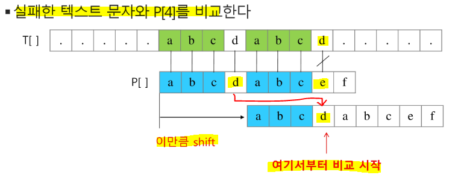
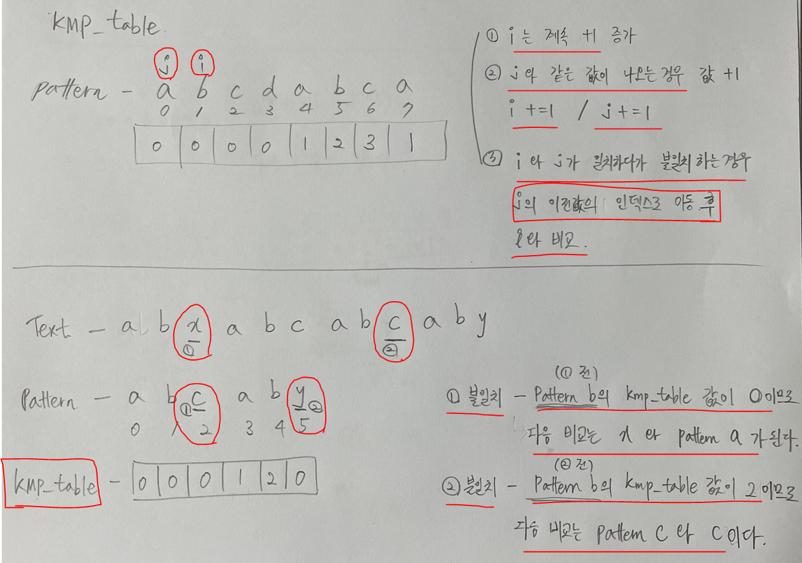
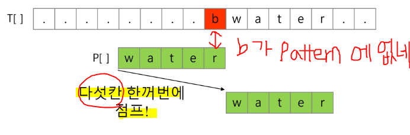
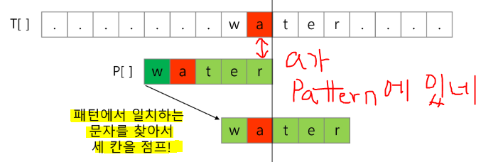
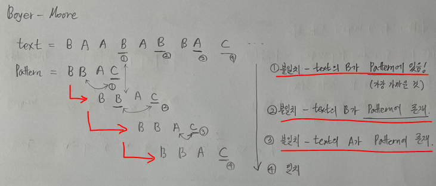

# 브루트포스 (Brute Force)

> 완전 검색(Exaustive Search)이라고도 하며, **모든 경우의 수(순열, 조합, 부분집합 등)를 내열해보고 확인하는 기법을 의미** / 가장 기본적인 알고리즘

* **일반적으로 경우의 수가 작을 때 유용**

* **수행 속도가 느리지만, 해답을 찾아내지 못할 확률은 낮다.**

* 예) {1, 2, 3}을 포함하는 모든 순열을 생성하는 함수

```python
for i1 in range(1, 4):
    for i2 in range(1, 4):
        if i2 != i1:
            for i3 in range(1, 4):
                if i3 != i1 and i3 != i2:
                    print(i1, i2, i3)
```

## ▶ 종류

* **선형 구조를 전체 탐색하는 순차 탐색**

* **비선형 구조를 전체 탐색하는 깊이 우선 탐색(DFS), 너비 우선 탐색(BFS)**

## ▶ 구현 방법

* for 문 or while 문으로 loop를 만들기

* 재귀함수를 활용하기

```python
text = 'This is a book~!'
pattern = 'is'

def bruteForce(pattern, text):
    M = len(pattern)                        # 패턴의 길이
    N = len(text)                           # 텍스트의 길이

    for idx in range(N - M + 1):            
        for jdx in range(M):                # 패턴의 길이만큼 순회
            if pattern[jdx] != text[idx]:
                break                       # break 하면 idx가 +1 된다.
        else:                               # else 작동은 break를 넘어갔다는 의미 = 패턴이 매칭된 상태
            return idx
    else:                                   # 전부 다 확인했는데 매칭이 안된 경우
        return -1

print(bruteForce(pattern, text))
```

## ▶ 문자열 매칭에서의 시간 복잡도 = O(M * N)

* M = 찾을 패턴의 길이

* N = 전체 텍스트의 길이

# KMP (Knuth-Morris-Pratt)

> 불일치가 발생한 텍스트 스트링의 앞 부분에 어떤 문자가 있는지를 미리 알고 있으므로, **불일치가 발생한 앞 부분에 대하여 다시 비교하지 않고 매칭을 수행!**



* 텍스트에서 abcdabc 까지는 매치되고, **e 에서 실패한 상황 패턴의 맨 앞의 abc와 실패 직전의 abc는 동일한 것을 미리 알고 한 번에 이동을 함**

* **매칭이 실패했을 때 돌아갈 곳을 미리 계산 = KMP_table**

* **KMP_table**
  
  * pattern = abcdabca
  
  * KMP_table = 0 0 0 0 1 2 3 1
    
    * 1️⃣ **매 단계마다 i += 1**
    
    * 2️⃣ **i와 j 비교 시 같은 값 - i += 1 & j += 1**
    
    * 3️⃣ **i와 j 같은 값이 나오다가 불일치 - j의 이전 KMP_table 값이 가리키는 pattern의 인덱스로 이동 후 i 와 비교**



```python
def pre_process(pattern):
    # 전처리를 위한 테이블을 작성(LPS Table: Longest prefix suffix)
    lps = [0] * len(pattern)
    j = 0                               # lps를 만들기 위한 prefix index

    for i in range(1, len(pattern)):    # 0번째 자리는 pattern 확인 필요 X
        # prefix index 위치에 있는 문자와 비교
        if pattern[i] == pattern[j]:    # 같은 문자 있는 경우
            lps[i] = j + 1              # i 의 앞에 중복되는 패턴이 존재
            j += 1                      # j 는 중복된 글자의 자리수
        else:                           # 같은 문자 없는 경우
            j = 0                       # j 초기화 / lps는 어차피 처음부터 돌아감
            # 0으로 이동한 다음 prefix idx 비교를 한 번 더 진행
            if pattern[i] == pattern[j]:
                lps[i] = j + 1
                j += 1

    return lps


def KMP(text, pattern):
    lps = pre_process(pattern)          # 전처리로 lps table 생성

    i = 0                               # text index
    j = 0                               # pattern
    while i < len(text):
        if pattern[j] == text[i]:       # 서로 같은 문자라면 다음 문자 비교
            i += 1
            j += 1
        else:                           # 같은 문자가 아니라면
            if j != 0:                  # j 가 0이 아닌 경우
                j = lps[j - 1]          # j 는 lps의 값으로 변경됨
            else:
                i += 1

        if j == len(pattern):           # pattern이 전부 일치할 때
            return i - j                # text의 위치

    return -1                           # 일치하는 문장이 없는 경우

text = 'ABC ABCDAB ABCDABCDABDE'
pattern='ABCDABC'

print(KMP(text, pattern))
```

## ▶ 시간 복잡도 = O(M + N)

* M = text 의 길이

* N = pattern 의 길이

# Boyer-Moore

> 대부분의 상용 소프트웨어에서 채택하고 있는 알고리즘

* **오른쪽에서 왼쪽으로 비교 - 패턴에 오른쪽 끝에 있는 문자가 불일치 하고 이 문자가 패턴 내에 존재하지 않는 경우 이동 거리는 패턴의 길이만큼 된다.**



* **오른쪽 끝에 있는 문자가 불일치하지만 이 문자가 패턴 내에 존재하는 경우**





```python
def pre_process(pattern):
    M = len(pattern)            # 패턴의 길이

    skip_table = dict()
    for i in range(M-1):
        # 패턴의 길이 - 인덱스 - 1 해야 원하는 위치만큼 이동
        skip_table[pattern[i]] = M - i - 1

    return skip_table


def boyer_moore(text, pattern):
    skip_table = pre_process(pattern)
    M = len(pattern)

    i = 0       # text index
    while i <= len(text) - M:                   # 비교할 전체 길이 = text 개수 - pattern의 개수
        j = M - 1                               # pattern index = 뒤에서 비교해야하므로 j를 끝에 index로 설정!
        k = i + (M - 1)                         # 비교를 시작할 위치 = 현재 위치 + M번째 인덱스

        # 비교할 j가 남아있고, text와 pattern이 일치하면 그 다음 앞에 글자를 비교하기 위해 index 감소
        while j >= 0 and pattern[j] == text[k]:
            j -= 1
            k -= 1

        if j == -1:                             # 일치함을 의미
            return i
        # 일치하지 않는 경우
        else:
            # i를 비교할 시작 위치를 skip_table에서 가져온다.
            i += skip_table.get(text[i+M-1], M)

    return -1                                   # 일치되는 패턴이 없음을 의미

text = 'ABC ABCDAB ABCDABCDABDE'
pattern='ABCDABC'

print(boyer_moore(text, pattern))
```

## ▶ 평균 시간 복잡도 = O(N) 보다 시간이 덜 든다.

* **Broute 와 KMP의 공통점 - 텍스트 문자열의 문자를 적어도 한 번씩 훑는다. = 최선의 경우도 O(N)**

* **Boyer-Moore 알고리즘은 텍스트 문자를 다 보지 않아도 된다.**

* **최악의 경우 = O(M * N)**
