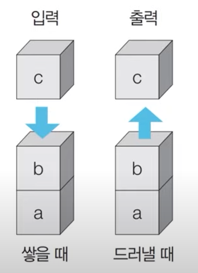
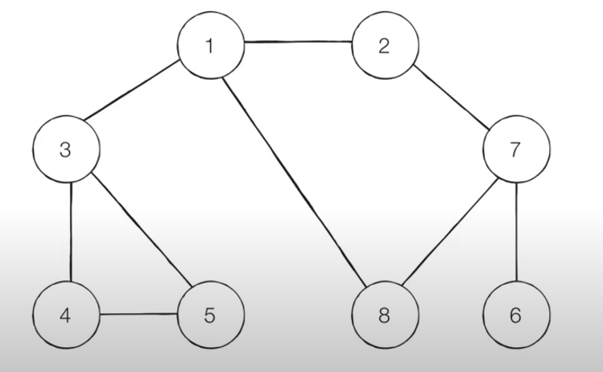
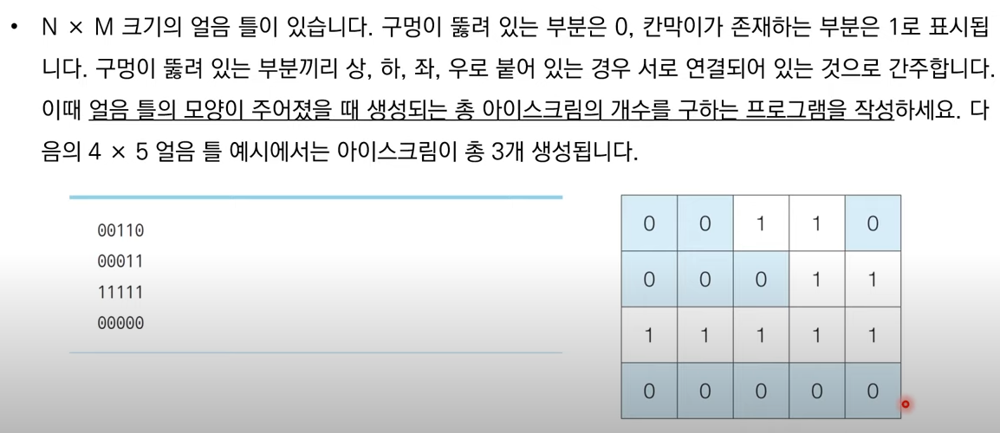
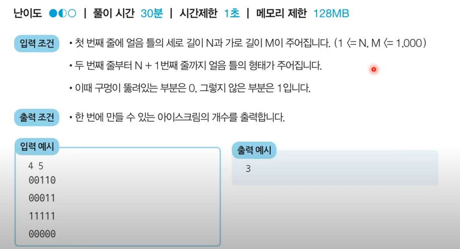

# :orange_book: 스택

- 먼저 들어온 데이터가 나중에 나가는 형식 선입후출의 자료구조
- 입구와 출구가 동일한 형태로 스택을 시각화 - 박스쌓기




### 스택 동작 예시

- 삽입
- 삭제

```python
stack = []


# 삽입5 삽입2 삽입3 삽입7 삭제 삽입1 삽입4 삭제
stack.append(5)
stack.append(2)
stack.append(3)
stack.append(7)
stack.pop()
stack.append(1)
stack.append(4)
stack.pop()


print(stack[::-1]) #[1,3,2,5] 최상단 원소부터 출력, 가장 먼저 나가는 순서
print(stack) #[5,2,3,1] 최하단 원소 부터 출력
```


# :green_book: 재귀함수

- Recursive Fuction : 자기자신을 다시 호출하는 함수를 의미한다.

- dfs를 실질적으로 구현하고자 할때 자주 사용되는 방법 중 하나

- 단순한 형태의 재귀함수 예제

  - 재귀 함수를 호출합니다 라는 문자열을 무한히 출력합니다

  - 어느정도 출력하다가 최대 재귀 깊이 초과 메세지가 출력됩니다. 

    ```python
    def recursicve_fuction():
        print('재귀 함수를 호출합니다'.)
        recursicve_fuction()
        
    recursicve_fuction()
    
    ```

  

  - 재귀함수 종료 조건

    - 재귀 함수를 문제 풀이에 사용할 때는 재귀 함수의 종료 조건을 반드시 명시해야한다.

    - 종료 조건을 제대로 명시하지 않으면 함수가 무한히 호출될 수 있기 때문에

    - 종료 조건을 포함한 재귀함수 예시

      ```python
      def recursicve_fuction(i):
          # i 가 100번째 호출을 했을때 종료되도록 종료 조건 명시 
          if i == 100:
              return
      
          print(i, '번째 재귀함수에서', i+1, '번째 재귀함수를 호출합니다.')
          recursicve_fuction(i+1)
          print(i, '번째 재귀함수를 종료합니다.')
      
      recursicve_fuction(1)
      
      ```

    - 팩토리얼 재귀함수로 구현

      ```python
      
      # 팩토리얼 구현
      #반복적으로 구현한 n!
      def factirial(n):
          result = 1
          for i in range(1, n+1):
              result *= i
          return result
      
      
      def factorial_recursive(n):
          if n <= 1: # n이 1 이하인 경우 1을 반환
              return 1 
          # n * (n-1)을 그대로 코드로 작성
          return n* factorial_recursive(n-1)
      
      print(factirial(5)) #120
      print(factorial_recursive(5)) #120
      ```

      

  - 재귀함수 사용시 유의사항
    -  복잡한 알고리즘을 간결하게 가능하지만 가독성이 떨어질수 있으므로 신중하게 사용
    - 스택을 사용할때 스택 라이브러리 대신 재귀함수를 이용하는 경우가 많다
      - 컴퓨터가 함수를 연속적으로 호출하면 컴퓨터 메모리 내부에 스택 프레임이 쌓이기 때문에

   

# 그래프 탐색 알고리즘 

- 탐색이란 많은 양의 데이터 중에서 원하는 데이터를 찾는 과정
- 대표적인 그래프 탐색 알고리즘 DFS/BFS
- DFS/BFS 는 코딩테스트에 자주 출제


# :star:DFS

- Depth-First Search 는 깊이 우선 탐색이라고 부르고, 그래프에서 깊은 부분을 우선적으로 탐색하는 알고리즘이다.

- DFS는 스택자료구조나 재귀함수를 이용한다

  - 탐색 시작 노드를 스택에 삽입하고 방문처리 한다.

  - 스택의 최상단 노드에 방문하지 않은 인접한 노드가 하나라도 있으면, 그 노드를 스택에 넣고 방문처리한다.
    방문하지 않은 인접 노드가 없으면 스택에서 최상단 노드를 꺼낸다.

  - 더이상 2번의 과정을 수행할 수 없을때 까지 반복한다. 

  - 시작노드 1 (방문기준: 번호가 낮은 노드부터 )

    

- 탐색 순서: 1 - 2 - 7 - 6 - 8 -3 - 4 - 5

  ```python
  # dfs 메서드 정리
  def dfs(graph, v, visited):
      # 현재 노드를 방문처리
      visited[v] == True
      print(v, end = ' ')
      # 현재 노드와 연결된 다른 노드를 재귀적으로 방문 처리 
      for i in graph(v):
          if not visited[i]:
              dfs(graph, i , visited)
  
   # 각 노드가 연결된 정보를 표현 2차원 리스트            
  graph = [[], [2,3,8], [1,7], [1,4,5], [3,5], [3,4], [7], [2,6,8], [1,7]]
  
  # 각 노드가 방문된 정보를 표현
  visited = [False] * 9
  
  dfs(graph,1,visited)
  ```
  
  

### dfs 예시 





```python


def dfs(x,y):
    if x <= -1 or x >= n or y <= -1 or y >= m:
        return False

    if graph[x][y] == 0:
        graph[x][y] == 1
        dfs(x-1, y)
        dfs(x, y-1)
        dfs(x+1, y)
        dfs(x, y+1)

        return True

    return True


n, m = map(int, input().split())

graph = []
# 2차원 맵정보
for i in range(n):
    graph.append(list(map(int, input())))


result = 0
# 모든 위치에 대해 음료수 채우기
for i in range(n):
    for j in range(m):
        if dfs(i,j) == True:
            result +=1


print(result)
```

